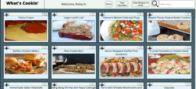

# Refactor Tractor - Whats Cookin': Group Project

### Contributors
* __Pat Findley__ (GitHub: [Patfindley](https://github.com/Patfindley))
* __Andrew Carlin__ (GitHub: [AndieDrew](https://github.com/AndieDrew))
* __Tyson McNutt__ (GitHub: [tysnj](https://github.com/tysnj))

## Abstract
This meal planning application presents users with a host of recipe options that they can choose to favorite and/or add to a to-do list. Users can only add a recipe to their to-do list if they have the required ingredients, and the ingredients' amounts are subtracted from their pantry when doing so; conversely, removing a recipe from the to-do list replaces the ingredients' amounts in the user's pantry.

When opening a recipe card, a user sees what ingredients are needed for the recipe, including instructions to make the recipe with the total cost of the recipe's ingredients.

A user can search across recipe's names and ingredients.

## Learning Goals
Working from an existing codebase, our objective was to refactor code while working toward our learning goals. They were:
* Build on top of pre-existing code that you did not write and navigate someone else’s codebase
* Make network requests to API endpoints to retrieve and manipulate data
* Refactor pre-existing code and use inheritance to DRY up repetitive logic
* Ensure your app is following best practices for accessibility
* Leverage Sass to DRY up your CSS
* Incorporate Webpack to streamline your workflow process

## Setup
Clone down this repository to your local machine with `git clone git@github.com:AndieDrew/refactorTractor.git`

Once cloned, change into this repo directly with `cd refactorTractor`

Run `npm install`

Run `npm start`

In your browser, navigate to http://localhost:8080/

###### You'll also need to set up the data server:
Clone down this repository to your local machine with `git clone git@github.com:turingschool-examples/whats-cookin-api.git`

cd into it with `cd whats-cookin-api`.

run `npm install`

run `npm start`

## In Action
In this example, Retta (our user) has the ingredients for the Pastry Cream, but they do not have ingredients for Vegan Lentil Loaf.

## Wins
- Consistently maintaining a project board and staying on task with our sprint planning to meet learning goals by due date
- Gaining more experience with SCSS, accessibility development, fetching network requests, and iterator prototypes

## Challenges
- Many users stories were incomplete or had broken functionality.

## Technologies Used
- JavaScript, ES6
- SCSS / SASS
- Webpack

## Systems/Practices
- git/Version Control
- PR Template
- Project Board
- TDD
